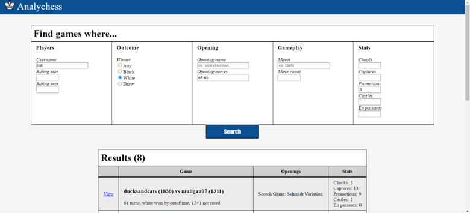
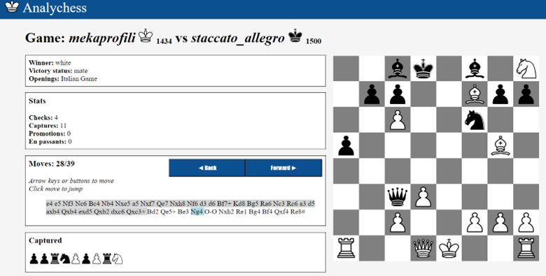

# chess-website

A browsable catalog of chess games

**Choose your search criteria...**

**... and then analyze to your heart's content**

**Features**
1. Database of real-world chess games from lichess.org
3. Thoughtfully designed API
4. Javascript-enabled chess board replay

Made by Charles Nykamp and Barry Nwike for Software Design (Fall 2022 course) at Carleton College.

Data licensed under CC0: Public Domain. Access the data here: https://www.kaggle.com/datasets/datasnaek/chess
